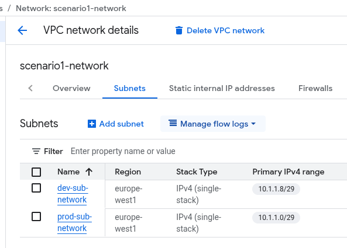

# ProductivityTools.Learning.NetworkScenarios

Scenario 1:
- Prod and Dev VPN should be connected with VPC Network peering
- WebServer should be accessed from the Internet
- Database should be accessed from WebServer
- SRE should have access to WebServer and Database server
- Dev VM should not be allowed to acces WebServer nor Database server
- Dev VM should not be allowed to access facebook

Tutorial:
- Create VPC network with two subnets

Create a rule for Network to allow for remote connection

