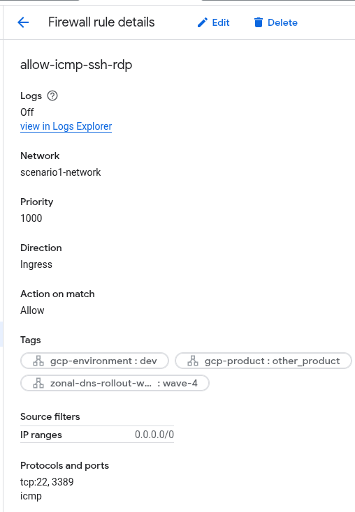

# ProductivityTools.Learning.NetworkScenarios

Scenario 1:
- Prod and Dev VPN should be connected with VPC Network peering
- WebServer should be accessed from the Internet
- Database should be accessed from WebServer
- SRE should have access to WebServer and Database server
- Dev VM should not be allowed to acces WebServer nor Database server
- Dev VM should not be allowed to access facebook


Tutorial:
- Create VPC network with two subnets


Create a rule for Network to allow for remote connection



Create 4 VMs


Install Apache on DatabaseServer

```
sudo apt-get update
sudo apt-get install apache2 -y 
echo '<!doctype html><html><body><h1>Hello World!</h1></body></html>' | sudo tee /var/www/html/index.html
for ((i=1;i<=50;i++)); do curl $MY_SERVER; done
```